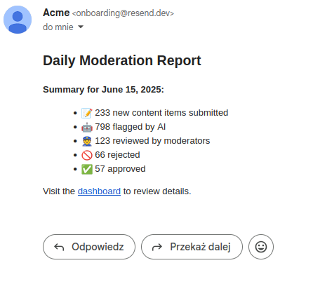

# 🧠 AI Content Moderation Platform

## 💼 What It Does

A system with built-in moderation and analysis using AI. Can be used as SaaS or headless microservice.

### Core Features

- 🔒 User authentication and authorization
- ⚡️ Streaming content processing via Kafka
- 🧠 Content analysis using LLMs (moderation, classification, tagging, sentiment)
- 🛢 Data storage using PostgreSQL
- 📊 Admin panel to review and manage flagged content

---

## 🧱 Modules

### 👤 Users

- Registration / Login
- User roles: `admin`, `reviewer`

### ✍️ Content Creation

- User-generated content is submitted via API by an external system.
- The content payload includes metadata like user_id, source, and submitted_at.
- Upon submission, the content is pushed to a Kafka topic for asynchronous processing by AI moderation services.
- The API immediately returns an acknowledgment (e.g., 202 Accepted) while processing happens in the background.


### 🤖 LLM Worker

- Listens to Kafka for new content
- Listens to Kafka for new content
- Analyzes:
  - Banned phrases
  - Spam detection
  - Auto-tagging
  - Sentiment analysis
- Sends the result back to the database or triggers an alert
  - Banned phrases
  - Spam detection
  - Auto-tagging
  - Sentiment analysis
- Sends the result back to the database or triggers an alert

### 🛠 Admin Panel

- List of suspicious or flagged content
- List of suspicious or flagged content
- Admin actions:
  - ✅ Approve
  - ❌ Delete
  - ✏️ Request correction
  - ✅ Approve
  - ❌ Delete
  - ✏️ Request correction

### 📈 Dashboard

- Statistics:
  - Number of submissions
  - Classification results
  - User activity

### Email Integration

#### Daily Reports


## Development

### Prerequisites
- docker compose
- npm

### 🛠️ Available Makefile Targets

Please use `make restart` to setup the whole project


| Command             | Description                                                         |
|---------------------|---------------------------------------------------------------------|
| `make start`        | Starts Docker containers and launches the frontend dev server.      |
| `make stop`         | Stops all running services and the frontend dev server.             |
| `make rebuild`      | Rebuilds Docker containers from scratch.                            |
| `make restart`      | Full teardown, rebuild, startup, and fixture loading.               |
| `make load_fixtures`| Loads predefined database fixtures into the backend container.


### 📘 Swagger API Docs

To view the Swagger UI for the API, navigate to:
http://localhost:4040/api/v1/ui


### 🧪 Testing Backend

To run backend tests locally:

```bash
cd backend
make run_test_db
pytest
```

### Observability

- Sentry for error tracking
